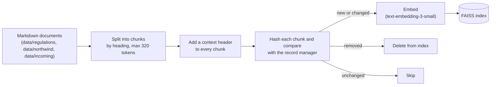
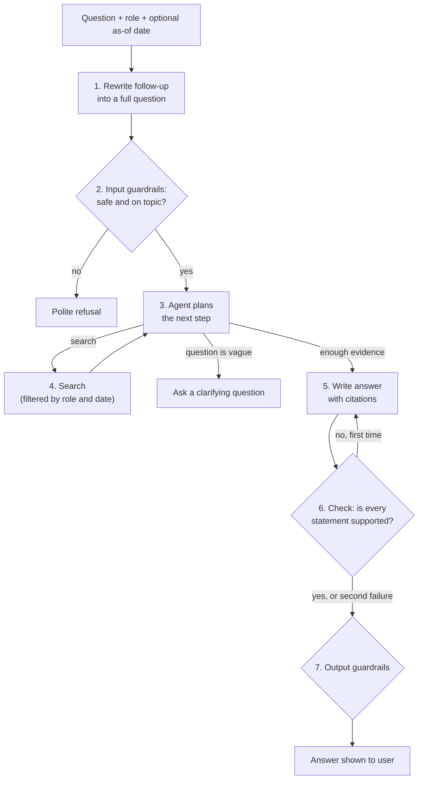
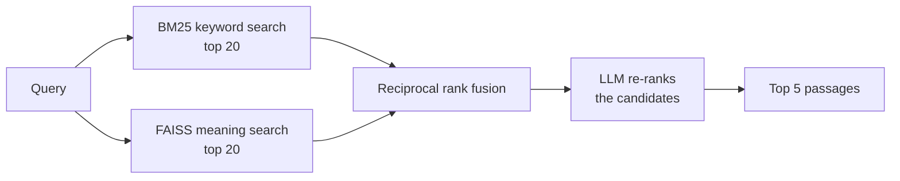

# Learning Compliance RAG

A question-answering assistant for **compliance training**. It answers questions about which training employees need, how often, and why. Answers come from real U.S. safety and health-privacy regulations and from an organization's internal policies, procedures and course catalog. Every answer cites the exact regulation paragraph or policy clause it relies on. The assistant separates what the law requires from what the organization has chosen to require, respects who is asking, and declines when the documents don't contain the answer.

- **Approach:** retrieval-augmented generation (RAG). The assistant first searches a document collection, then a large language model (LLM) writes an answer using only the passages it found.
- **Domain:** enterprise documents in learning and compliance: regulations, policies, standard operating procedures (SOPs), course catalogs, audit reports and e-mails.
- **Built with:** LangGraph and LangChain (orchestration), FAISS (Facebook AI Similarity Search, a vector-search library) and BM25 (Best Matching 25, a keyword-ranking formula) for search, NeMo Guardrails (safety checks), OpenAI models (any OpenAI-compatible server such as Ollama or vLLM also works), FastAPI and Gradio (application programming interface (API) and chat user interface (UI)).

A two-page technical write-up is in [writeup/writeup.pdf](writeup/writeup.pdf).

## 1. Problem

Organizations that run a learning management system (LMS) have to keep training assignments in line with regulation. Two sets of rules come up constantly: workplace-safety rules from the Occupational Safety and Health Administration (OSHA), and health-privacy rules under the Health Insurance Portability and Accountability Act (HIPAA). Teams in learning & development (L&D), human resources (HR) and environment, health & safety (EHS) regularly ask questions such as:

- "Which training does a forklift operator need, how often, and which of our courses covers it?"
- "Our policy says HIPAA refresher training is annual. Is that the law or our own rule?"
- "A supervisor e-mailed that forklift re-evaluations are every 24 months now. Is that right?"
- "Which rule applied when this employee was hired in 2025?" (auditors ask about past dates)

The answer is usually spread across three kinds of documents:

- **Regulations:** the legal source of truth, cited down to the paragraph. Examples are OSHA and HIPAA.
- **Internal policies:** often stricter than the law, versioned, and not public.
- **The course catalog and role matrix:** which course covers which requirement, and which roles take it.

Cross-referencing these by hand is slow and error-prone. Mistakes lead to training being assigned wrongly, failed audits and regulatory exposure.

**Why RAG fits:**
- Every answer has to be traceable to a specific paragraph so that someone can check it, and RAG answers from retrieved text with citations.
- The rules change with every policy version. With RAG, a document update takes effect as soon as the index is refreshed.
- Fine-tuning a model would bake in rules that go out of date, and it cannot cite sources.
- A plain LLM without retrieval does not know the organization's internal rules.

## 2. Data

| Source | What it is | Documents |
|---|---|---|
| Electronic Code of Federal Regulations (eCFR, the official online U.S. regulations), plus the California Legislative Information site | Real regulation text: 10 OSHA workplace-safety sections, 2 HIPAA sections, and California's harassment-prevention training law. Fetched for a fixed date, 2026-09-01, so the text never changes between runs. | 13 |
| Northwind Manufacturing & Health (fictional) | Internal documents written for this project: policy (current and superseded versions), course catalog, role matrix, procedures, audit memo, FAQ, e-mails | 15 |

The fictional documents deliberately include problems found in real corpora:
- a superseded policy version that is still stored
- an e-mail with a wrong claim
- an e-mail containing hidden instructions aimed at AI assistants
- documents only some roles may see

Details, assumptions and the gap to real-world data: [data/README.md](data/README.md).

## 3. How it works

### 3.1 Indexing pipeline: documents → searchable index



**Run it:** `python -m lcrag.indexing` (code: [`src/lcrag/indexing.py`](src/lcrag/indexing.py)). The first run builds the index. Every later run applies only the differences.

**How each kind of change is handled.** The pipeline uses LangChain's Indexing API. A small SQLite database (the *record manager*) remembers a hash of every chunk and which file it came from.

| Change in the corpus | What happens | Measured ([results/freshness.md](results/freshness.md)) |
|---|---|---|
| Nothing changed | Every chunk's hash is already known, so nothing is embedded | 0 embedded, 965 skipped |
| New document added (e.g. dropped into `data/incoming/`) | Only its chunks are embedded | 2 embedded |
| Document edited | Only chunks whose text changed are re-embedded; its old chunks are deleted | 1 embedded, 1 deleted, 966 skipped |
| Document deleted | All of its chunks are removed from the index | 2 deleted |
| New policy version replaces an old one | The old version stays searchable for history questions. Its chunks are labelled SUPERSEDED, and it is excluded when a question asks about a date after it was replaced. | – |
| Regulation amended | Re-run `python data/fetch_regulations.py --date <new date>`, then the indexer. Only amended paragraphs are re-embedded. | – |

No full re-embedding is ever needed. Each run re-reads and re-hashes the corpus, which takes about a second; only changed text costs embedding calls.

### 3.2 Answering a question



The flow is a LangGraph graph ([`src/lcrag/graph.py`](src/lcrag/graph.py)):

1. **Rewrite the follow-up.** Conversations are remembered per conversation ID, and the history survives restarts. A follow-up such as "and what does OSHA itself require?" is rewritten into a full question using the recent turns, so the search sees "What does OSHA require for forklift operator re-evaluation?".
2. **Input guardrails** (NeMo Guardrails):
   - A pattern check blocks personal data, such as social security or card numbers, without calling any model.
   - A small model then blocks attempts to override the assistant's instructions, off-topic requests, questions about a named person's records, and requests to evade a rule ("how can we backdate certificates?").
3. **Plan.** An LLM agent decides what to search for. It has two tools: `Search(query, source)`, where `source` can be regulations only, internal documents only, or both, and `Clarify(question)`. Its first step must call one of them, so it can never answer without looking something up.
4. **Search.** The search tool runs a hybrid search, described in 3.3. The user's role and the as-of date are taken from the request and applied inside the search function. The agent only chooses the query text and the source, so it cannot widen what the user is allowed to see. If the agent sends a query identical to an earlier one, the tool returns "Already searched" instead of running it. The loop stops after 3 searches.
5. **Write the answer.** A separate model call writes the answer from the collected passages, at most 10 of them. The answer uses a fixed output format: the text with `[S1]`-style citations, a status (answered, needs clarification, not in the documents, out of scope) and an optional clarifying question.
6. **Check grounding.** A checker model compares the answer with the passages and lists any statement they do not support. If there is one, the writer gets one chance to fix it. If the second attempt still fails, the answer is shown with an "unverified" warning and flagged for human review.
7. **Output guardrails.** The same pattern check runs again, plus a model check for disclosure of personal data, advice on evading rules, or instructions that leaked in from a document.

**Why an agent instead of a single search.** Several question types need more than one lookup:
- *Law vs. policy.* For "Is the annual HIPAA refresher legally required?", a single search returns mostly internal documents, because they use the same words as the question. The HIPAA regulation itself never says "annual refresher". The agent runs one search restricted to regulations and one restricted to internal documents, so both sides are in front of the writer.
- *Multi-step questions.* "Which courses does a Clinic Nurse take, and which repeat yearly?" needs the role matrix first, then the course catalog.
- *Poor first results.* If results are irrelevant, or dominated by an e-mail or an old policy, the agent searches again with other wording, for example the regulation's own term "powered industrial truck" instead of "forklift".

The agent only decides *what to look up*. The writer, the grounding check and the guardrails are separate steps outside its control, so it cannot skip them.

### 3.3 One search (hybrid retrieval)



- **BM25** finds exact terms. Its tokenizer keeps citations and codes whole, so "1910.178(l)(4)" and "EHS-FL-201" are not split into meaningless pieces.
- **FAISS** finds passages with similar meaning (by comparing embeddings), even without shared words.
- **Reciprocal rank fusion (RRF)** merges the two ranked lists using positions only. BM25 and vector scores are on different scales and cannot be added directly.
- **Re-ranking:** an LLM reads the candidates together and orders them by relevance to the query. If it returns an invalid ranking, the fused order is used instead.
- **Filters** run inside the search, before any ranking, so restricted text never reaches a model:
  - access by role
  - as-of date
  - regulation vs. internal

Code: [`src/lcrag/retrieval.py`](src/lcrag/retrieval.py).

### 3.4 Terms used in this document

| Term | Meaning here |
|---|---|
| Chunk | A piece of a document, at most 320 tokens: typically one regulation paragraph group or one policy section. It is the unit that gets searched and cited. |
| Context header | Two lines added to the start of every chunk: document, citation, everyday topic (e.g. "forklift"), section, version, and whether it is superseded. It makes a chunk understandable on its own. |
| Embedding | A list of numbers representing a text's meaning; similar texts have similar embeddings. |
| Indexing / ingest | Loading documents, chunking them, computing embeddings and storing them so they can be searched. |
| Delta indexing | Updating the index with only what changed, instead of rebuilding it. |
| As-of date | An optional date on a question. Only documents in force on that date are used: already effective, and not yet superseded. It is used for audit questions about the past. |
| Role | Who is asking (employee, manager, EHS, LMS admin, compliance). Each document lists which roles may see it. Compliance sees everything. |
| Superseded | A policy version that has been replaced. It is kept for history but never used for current answers. |
| Guardrails | Checks before and after the model that block unsafe input or output. |
| Grounding / faithfulness | Whether every statement in an answer is supported by the retrieved passages. |
| Hallucination | A statement the model produced that the sources do not support. |
| Thread | One conversation; memory is kept per thread. |

## 4. Key design decisions

The write-up explains each decision in more detail. This table summarizes the main one per component, with the alternative that was rejected.

| Component | Chosen | Rejected alternative, and why |
|---|---|---|
| Chunking | Split at headings (one regulation paragraph group or one policy section), max 320 tokens with 32 overlap, plus a context header | **Fixed 320-token windows:** 0.043 lower Recall@5 and 0.156 lower MRR. They cut through tables and paragraph lists. |
| Embeddings | `text-embedding-3-small` | **`text-embedding-3-large`:** better when used alone (Recall@5 0.859 vs. 0.791). The small model with re-ranking reaches 0.940, above the large model alone, at 6.5× lower embedding cost. |
| Retrieval | BM25 + dense search, fused with RRF, then an LLM re-ranker | **Dense only:** misses exact citations and codes. **Weighted score fusion:** needs score calibration between BM25 and dense scores. |
| Orchestration | A custom LangGraph agent that only plans the searches | **A fixed single-search pipeline:** cannot look up law and policy separately. **LangGraph's prebuilt ReAct (reason-and-act) agent:** would also write the final answer, skipping the fixed output format and the grounding check. |
| Hallucination control | Grounding check with one revision, plus an "unverified" flag | **A small natural-language-inference (NLI) model as the checker:** tried earlier; it misjudged paraphrases such as "forklift" vs. "powered industrial truck". |
| Vector store | FAISS, exact search | **A database-backed store (Chroma, pgvector):** unnecessary at 965 chunks, where exact search takes under a millisecond. pgvector becomes worthwhile with several writers or database-enforced permissions. |
| Guardrails | NeMo Guardrails, used for checks only | **Instructions in the prompt alone:** not reliable against prompt injection. **Llama Guard:** needs a separately hosted safety model. |
| Models | `gpt-4.1-nano` writes answers; `gpt-4.1-mini` plans, re-ranks, checks and runs the guardrails | **Nano for everything:** planning and checking became unreliable. For example, nano as the checker rejected most correct answers. |

## 5. Results

The evaluation set has 74 questions written from the documents. They cover 10 types: regulation facts, policy facts, law vs. policy, multi-document, exact identifiers, policy versions, conflicting sources, vague questions, questions the documents cannot answer, and off-topic questions. The questions are split once into development (27) and test (47) sets, stratified by type. All tuning used the development set, and the numbers below are on the test set. Full tables are in [results/](results/).

**Retrieval: one search, top 5 passages** (39 test questions that have known answer passages)

| Configuration | Precision@5 | Recall@5 | MRR | Recall@5 change vs. dense [95% CI] |
|---|---|---|---|---|
| Dense (FAISS) only | 0.292 | 0.791 | 0.751 | – |
| BM25 only | 0.236 | 0.688 | 0.692 | −0.103 [−0.252, +0.051] |
| Hybrid: BM25 + dense with RRF | 0.287 | 0.799 | 0.796 | +0.009 [−0.073, +0.103] |
| **Hybrid + LLM re-rank (used)** | **0.344** | **0.940** | **0.987** | **+0.150 [+0.047, +0.256]** |

How to read the metrics:
- *Recall@5* is the share of the known answer passages found in the top 5.
- *Precision@5* is the share of the top 5 that are answer passages. Most questions have only 1–3 answer passages, so it cannot go much above 0.4–0.6.
- *MRR* (mean reciprocal rank) is 1 when the first result is relevant, 0.5 when the second is, and so on.
- The interval is a paired bootstrap over questions.

**Full assistant** (47 test questions)

| Metric | Test |
|---|---|
| Correct outcome (answer / ask to clarify / decline) | 0.936 |
| Key facts correct in answers | 0.974 |
| Faithfulness: share of answer statements supported by the retrieved passages (judged by `gpt-4.1-mini`) | 0.982 |
| Faithfulness of answers that passed the grounding check | 0.994 |
| Answer passages found by the agent's searches (up to 10 passages) | 0.932 |
| Average searches per question | 1.7 |
| Latency / cost per question | 8.1 s / $0.007 |

**Safety checks: 21 of 21 passed** ([results/safety.md](results/safety.md)):
- Guardrails: 6 attacks blocked, 3 legitimate questions allowed.
- Access control: restricted documents never reached unauthorized roles, and authorized roles received them.
- As-of dates: 2 of 2.
- Follow-up questions using memory: 3 of 3.
- Hidden prompt injection resisted: 2 of 2.

**Examples**, with searches, retrieved passages, answer and faithfulness annotation: [results/examples.md](results/examples.md). Two show how unclear or off-topic questions are handled:
- *Vague:* "How often is refresher training required?" The assistant asks: "For which training topic or role do you want to know the refresher training interval?" It does not guess.
- *Off-topic:* "How do I reset my VPN password?" The input guardrail stops it before any search: "I can't help with that request. I answer questions about compliance-training requirements…"

## 6. Where it fails

- **Legal requirement attributed to the wrong source** (1 development question). Asked whether the law requires Northwind's 3-year hazard-communication refresher, the writer attributed the policy's 36-month interval to the regulation. The final status was "not in the documents", so the user didn't get the error as a confident answer, but the reasoning was wrong. The cheapest writer model mixes up sources when both are present.
- **Wrong paragraph quoted** (1 development question). Asked about 29 CFR 1910.178(l)(4)(iii), the writer quoted the neighbouring paragraph (l)(2)(iii). The grounding check caught it, and the answer was shown as "unverified" rather than as fact.
- **Correct answer, wrong status** (1 test question). The writer rejected the supervisor's 24-month claim correctly, but labelled the answer "out of scope".
- **Guardrail false positives** (2 cases):
  - A question the documents cannot answer ("training budget for Reno") was refused by the input guardrail as off-topic. The user still gets a refusal, but for the wrong reason.
  - One correct answer about a forklift incident was blocked by the output guardrail.
- **Conflicting and versioned questions** remain the hardest for retrieval. An informal e-mail or the old policy often matches the question's wording best. The rule that current policy outranks e-mails is enforced in the writing step, not in the search.
- **Evaluation limits:**
  - 74 questions give wide confidence intervals.
  - The fictional documents are cleaner than real ones.
  - One person wrote both the documents and the questions.

## 7. Production considerations

**1,000 concurrent questions.**
- *Bottleneck:* the language-model calls, about 6–9 per question: rewrite, two guardrail checks, 1–3 planning steps, one re-rank per search, writing and checking. Search itself takes milliseconds.
- *Throughput needed:* 1,000 questions in flight at about 8 s each is roughly 125 questions per second, or about 900 model calls per second. That needs raised provider rate limits or several model deployments.
- *Latency levers:*
  - asynchronous workers
  - running the input guardrail in parallel with the first search
  - caching repeated questions (a cache is already built in)
  - replacing the LLM re-ranker with a hosted cross-encoder (a fast relevance model), which removes up to 3 calls per question
- *State:* move conversation memory from SQLite to Postgres, and put the index on shared storage so several servers can run.

**Before real deployment:**
- The role must come from single sign-on (SSO), not from a dropdown.
- Unverified answers and 👎 feedback need a reviewer workflow.
- Scanned PDF documents would need an optical character recognition (OCR) step.

**Already in place:**
- Every question is logged to `logs/audit.jsonl` with role, searches, sources, status, tokens and cost.
- User feedback goes to `logs/feedback.jsonl`.
- Full tracing in LangSmith needs only an environment variable (`LANGSMITH_TRACING=true`).

## 8. Repository layout

```
data/           regulations/ (fetched), northwind/ (fictional internal documents), fetch_regulations.py
src/lcrag/      config.py      settings and model setup
                corpus.py      load documents, split into chunks
                indexing.py    indexing pipeline with delta updates        (python -m lcrag.indexing)
                retrieval.py   hybrid search with role / date / source filters
                graph.py       the LangGraph agent
                prompts.py     all prompts
                guardrails.py  NeMo Guardrails checks (rails/ holds their configuration)
                assistant.py   memory, audit log, cost tracking
app/app.py      REST API (FastAPI) and chat UI (Gradio)
eval/           qa.yaml (questions), splits.yaml (dev/test), safety.yaml, evaluate.py
results/        retrieval.md, e2e.md, examples.md, safety.md, freshness.md
tests/          offline unit tests
writeup/        two-page technical write-up (PDF and source)
```

## 9. Setup and reproducing the results

Requires Python 3.11 and an OpenAI API key. Dependencies are pinned in `requirements.txt`.

```bash
uv venv --python 3.11 .venv && source .venv/bin/activate
uv pip install -r requirements.txt -e .
cp .env.example .env                        # add OPENAI_API_KEY

python -m lcrag.indexing                    # build the index (about 1,000 chunks, a few cents)
pytest -q tests                             # offline unit tests

python eval/evaluate.py retrieval           # -> results/retrieval.md
python eval/evaluate.py e2e                 # -> results/e2e.md, results/examples.md
python eval/evaluate.py safety              # -> results/safety.md
python eval/evaluate.py freshness           # -> results/freshness.md

python app/app.py                           # chat UI at http://127.0.0.1:7860, API docs at /docs
```

A full evaluation run costs about $1 in API usage.

- **Re-fetching the regulations:** they are committed, but `python data/fetch_regulations.py` downloads them again.
- **Local models:** set `LLM_BASE_URL` and `EMBED_BASE_URL` in `.env` to an Ollama or vLLM server.
- **Docker:** `docker build -t lcrag . && docker run -p 7860:7860 -e OPENAI_API_KEY lcrag`.
- **No login:** the app has no authentication. Keep it on localhost, or put it behind SSO.
